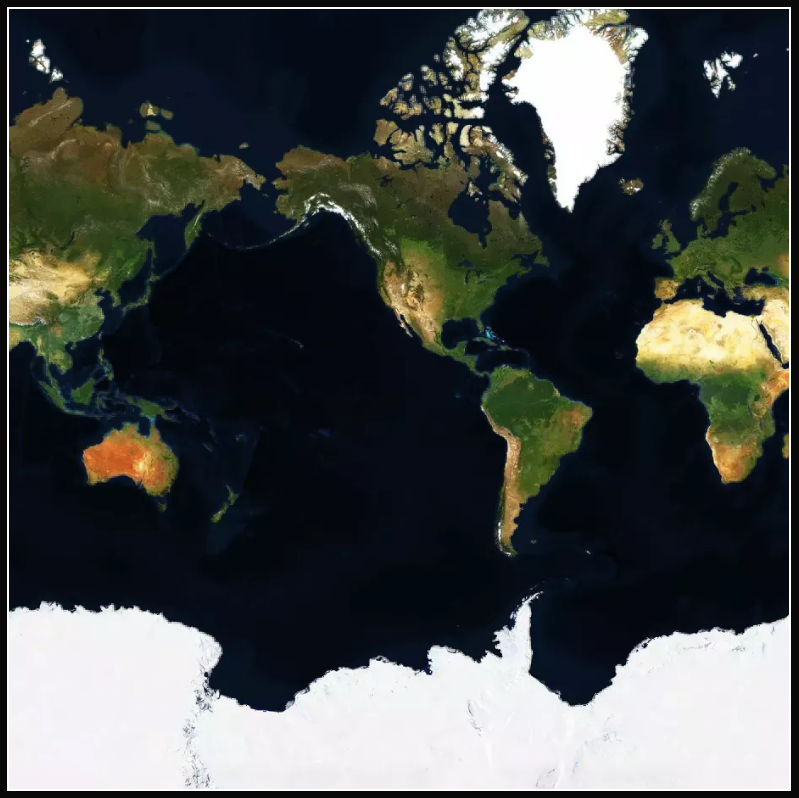
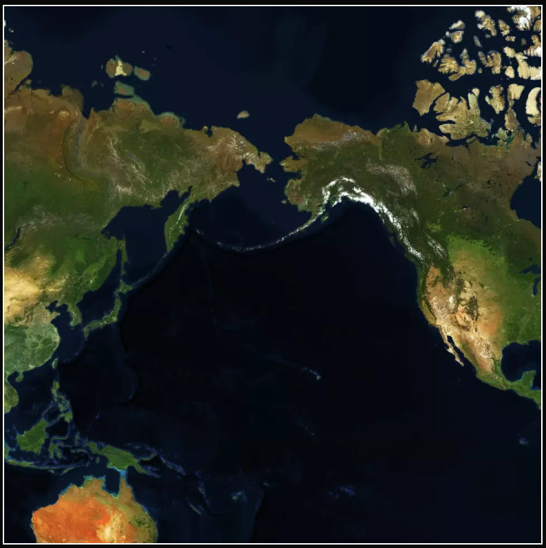
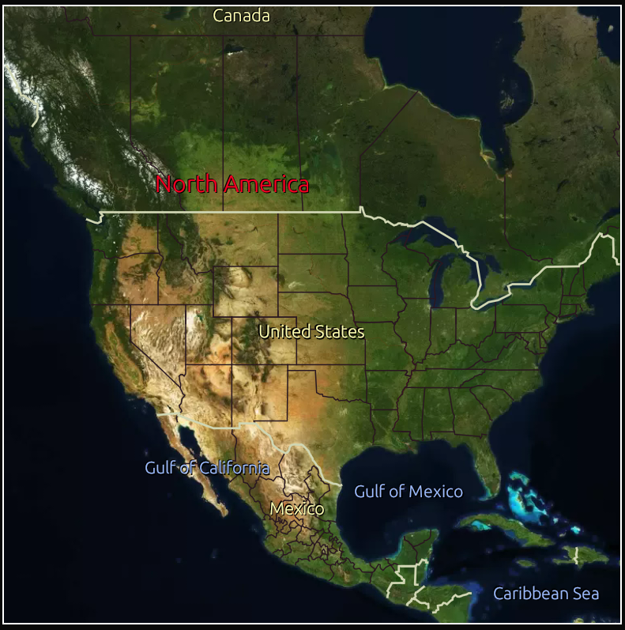

# Tripsavvy

Tripsavvy is an interactive mapping application written in Rust. It features a zoomable, draggable map rendered using raster tiles with caching support. The project provides a foundation for interactive map exploration and sets the stage for future enhancements such as integrating geo metadata (e.g. locations, cities) via the Mapbox API.

## Project Structure

```
.
├── .env
├── Cargo.lock
├── Cargo.toml
├── ReadMe.md
├── src
│   ├── main.rs
│   ├── map
│   │   ├── map.rs         // Interactive map logic: rendering, zoom, and pan (`Map::ui`), implements the Widget trait of egui
│   │   ├── map_tile.rs    // Tile definitions and coordinate calculations (`MapTile`)
│   │   └── mod.rs
│   ├── maps_api
│   │   ├── tile_retriever.rs  // Tile retrieval from external services like Mapbox (`TileRetriever`)
│   │   └── mod.rs
│   └── ui
│       ├── my_app.rs      // Main application UI integration (`MyApp`)
│       └── mod.rs
└── target
    └── ... (build artifacts)
```

## Live Examples

 - **Full, unstyled raster map**  
   

 - **Raster using horizontal wrapping**  
   
   (Wrapping occurs between Russia and Alaska, allowing seamless navigation)

 - **Raster with a simple overlay**  
   

## Project Intent

- **Interactive Map Experience:**  
  The application provides a dynamic map that users can drag and zoom. It leverages efficient caching (using an LRU cache) and precise tile calculation logic for smooth rendering.

- **Tile-Based Rendering:**  
  Raster tiles are used to render map backgrounds. The map handles missing tiles by attempting to fetch a parent tile ([`Map::fetch_parent_tile`](src/map/map.rs)) for visual continuity.

- **OSM Vector Tile Overlay:**  
  Vector tiles based on OpenStreetMap data can be overlaid on the raster map for a more detailed exploration, including borders, countries, cities, and other geographical features.

- **Future Extensions:**  
  Implementing a secondary widget, map settings, to control the map's appearance, behaviour, and overlay data, as well as navigation to specific locations.

## Current Implementations

- **Map Interaction and Rendering:**  
  The core rendering and interaction logic is managed in [`Map::ui`](src/map/map.rs). This function handles user input for dragging and zooming, updates the map state stored in [`MapState`](src/map/map.rs), and computes the visible tiles ([`Map::calculate_visible_tiles`](src/map/map.rs)).

- **Tile Caching and Fallbacks:**  
  Cached tiles are stored in an LRU cache to boost performance. If a tile is missing, it's added to a missing tiles list and a fallback mechanism attempts to retrieve a higher-level (parent) tile ([`Map::fetch_parent_tile`](src/map/map.rs)) until the ideal tile is rendered.

- **Tile API Integration:**  
  The [`TileRetriever`](src/maps_api/tile_retriever.rs) module is responsible for fetching and updating tile images from external sources like Mapbox. This module sets up the base for future integration of geo metadata.

- **User Interface:**  
  The UI is built using [egui](https://docs.rs/egui), and the main application logic is wrapped in [`MyApp`](src/ui/my_app.rs). The integration with the map component allows for a cohesive user experience in an `eframe` based GUI application.

## Running the Project

To build and run Tripsavvy, use Cargo:

```sh
cargo run
```

For a release build:

```sh
cargo run --release
```

## Future

 - egui and eframe are able to compile to wasm, making this project ideal for a web application. This would allow for a more interactive and engaging user experience, leveraging the web's capabilities for map exploration on any device.